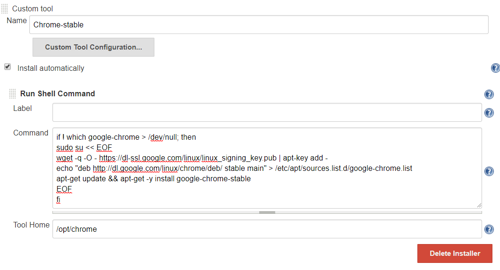

Table of Contents

*   [Angular CI](#_angular_ci)
    *   [TESTING LINKS](#_testing_links)
    *   [Pipeline](#_pipeline)
    *   [Adjustments](#_adjustments)
        *   [Pipeline Environment](#_pipeline_environment)
        *   [Description](#_description)
*   [Angular design](#_angular_design)
    *   [Introduction](#_introduction)
    *   [Basic project structure](#_basic_project_structure)
    *   [Main Views and components](#_main_views_and_components)
        *   [Public area](#_public_area)

Angular CI
==========

TESTING LINKS
-------------

refer to [page1#bookmark-a](page1.html#bookmark-a) for more info

refer to [page1.asciidoc#bookmark-a](page1.html#bookmark-a) for more info

[link:./page1](./page1)

[link:./page1.asciidoc](./page1.asciidoc)

[link:page1#Pipeline](page1#Pipeline)

Xref page 1:

[xref:bookmark-a](#bookmark-a)

Anchor to page 1:

Click on [adjustments-id](#adjustments-id) to go to Adjustments

Links to page 2:

[link:./page2.asciidoc](./page2.asciidoc)

[link:page2#basic-project-structure](page2#basic-project-structure)

The Angular client-side of My Thai Star is going to have some specific needs for the CI-CD Pipeline to perform mandatory operations.

  

1

2

A

3

4

B

5

6

C

Pipeline
--------

The Pipeline for the Angular client-side is going to be called **MyThaiStar\_FRONTEND\_BUILD** . It is located in the PL instance, under the [MTS folder](https://devon.s2-eu.capgemini.com/jenkins/job/MTS/) (as previously explained). It is going to follow a process flow like this one:

Each of those steps are called _stages_ in the Jenkins context.Let’s see what those steps mean in the context of the Angular application:

1.  **Declarative: Checkout SCM**
    
2.  **Declarative: Tool Install**
    
3.  **Loading Custom Tools**
    
4.  **Fresh Dependency Installation**
    
5.  **Code Linting**
    
6.  **Execute Angular tests**
    
7.  **SonarQube code analysis**
    
8.  **Build Application**
    
9.  **Deliver application into Nexus**
    
10.  Declarative: Post Actions
    

Adjustments
-----------

The Angular project Pipeline needed some "extra" features to complete all planned processes. Those features resulted in some additions to the project.

### Pipeline Environment

In order to easily reuse the pipeline in other angular projects, all variables have been defined in the block environment. All variables have the default values that Production Line uses, so if you’re going to work in production line you won’t have to change anything. Example:

    environment {
        // Script for build the application. Defined at package.json
        buildScript = 'build --configuration=docker'
        // Script for lint the application. Defined at package.json
        lintScript = 'lint'
        // Script for test the application. Defined at package.json
        testScript = 'test:ci'
        // Angular directory
        angularDir = 'angular'
        // SRC folder. It will be angularDir/srcDir
        srcDir = 'src'
        // Name of the custom tool for chrome stable
        chrome = 'Chrome-stable'
    
        // sonarQube
        // Name of the sonarQube tool
        sonarTool = 'SonarQube'
        // Name of the sonarQube environment
        sonarEnv = "SonarQube"
    
        // Nexus
        // Artifact groupId
        groupId = 'com.devonfw.mythaistar'
        // Nexus repository ID
        repositoryId = 'pl-nexus'
        // Nexus internal URL
        repositoryUrl = 'http://nexus3-core:8081/nexus3/repository/maven-snapshots'
        // Maven global settings configuration ID
        globalSettingsId = 'MavenSettings'
        // Maven tool id
        mavenInstallation = 'Maven3'
    }

### Description

*   **buildScript** : script for build the applicaction. It must be defined at package.json.
    
*   **lintScript** : Script for lint the application. Defined at package.json
    
*   **testScript** : Script for test the application. Defined at package.json
    
*   **angularDir** : Relative route to angular application. In My Thai Star this is the angular folder. The actual directory (.) is also allowed.
    

*   **srcDir** : Directory where you store the soruce code. For angular applications the default value is `src`
    

*   **chrome** : Since you need a browser to run your tests, we must provide one. This variable contains the name of the custom tool for google chrome.
    

*   **sonarTool** : Name of the sonarQube scanner installation.
    

*   **sonarEnv** : Name of the sonarQube environment. SonarQube is the default value for PL.
    
*   **groupId** : Group id of the application. It will be used to storage the application in nexus3
    
*   **repositoryId** : Id of the nexus3 repository. It must be defined at maven global config file.
    
*   **repositoryUrl** : The url of the repository.
    
*   **globalSettingsId** : The id of the global settings file.
    
*   mavenInstallation: The name of the maven tool.
    

Angular design
==============

Introduction
------------

MyThaiStar client side has been built using latest frameworks, component libraries and designs:

**Angular** _4_ as main front-end Framework. [https://angular.io/](https://angular.io/)

**Angular/CLI** _1.0.5_ as Angular tool helper. [https://github.com/angular/angular-cli](https://github.com/angular/angular-cli)

**Covalent Teradata** _1.0.0-beta4_ as Angular native component library based on Material Design. [https://teradata.github.io/covalent/](https://teradata.github.io/covalent/)/

**Angular/Material2** _1.0.0-beta5_ used by Covalent Teradata. [https://github.com/angular/material2](https://github.com/angular/material2)

_Note: this dependencies are evolving at this moment and if it is possible, we are updating it on the project._

Basic project structure
-----------------------

The project is using the basic project seed that Angular/CLI provides with “ng new <project name>”. Then the app folder has been organized as Angular recommends and goes as follows:

*   app
    
    *   components
        
        *   sub-components
            
        *   shared
            
        *   component files
            
        
    *   main app component
        
    
*   assets folder
    
*   environments folder
    
*   rest of angular files
    

This structure can be shown in the following example image:

Main Views and components
-------------------------

List of components that serve as a main view to navigate or components developed to make atomically a group of functionalities which given their nature, can be highly reusable through the app.

_Note: no-name-route corresponds to whatever URL the user introduced and does not exist, it redirects to HomeComponent._

### Public area

#### AppComponent

Contains the components that are on top of all views, including:

##### Order sidenav

Sidenav where selected orders are displayed with their total price and some comments.