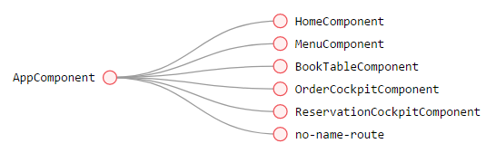

# BasicNgPwa

This project was generated with [Angular CLI](https://github.com/angular/angular-cli) version 7.3.7.

## Development server

;

;

[I'm an inline-style link](./document.md);

[Link to document.md#anchor](./document.md#anchor);

[Anchor to further help](#help)

Run `ng serve` for a dev server. Navigate to `http://localhost:4200/`. The app will automatically reload if you change any of the source files.

| Tables        | Are           | Cool  |
| ------------- |:-------------:| -----:|
| col 3 is      | right-aligned | $1600 |
| col 2 is      | centered      |   $12 |
| zebra stripes | are neat      |    $1 |

## Further help

To get more help on the Angular CLI use `ng help` or go check out the [Angular CLI README](https://github.com/angular/angular-cli/blob/master/README.md).